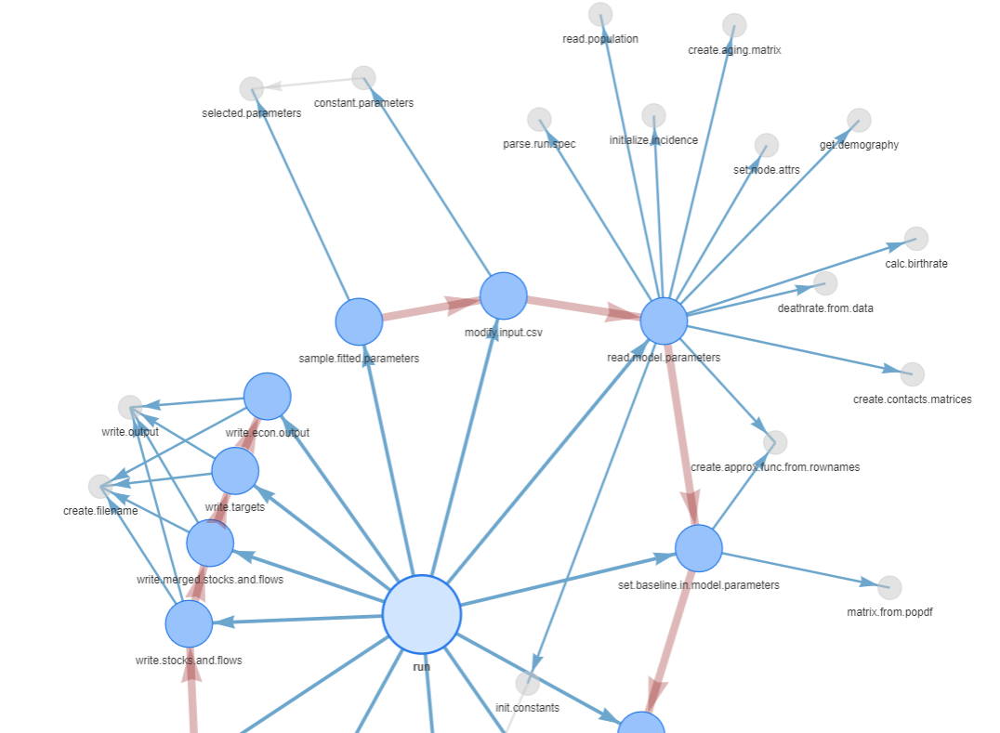

# Network showing the structure of functions within the tbvax package:

Tbvax is a model of TB transmission and various preventative strategies, including vaccination, treatment, etc., developped at the London School of Hygiene and Tropcial Medicine [https://github.com/lshtm-tbmg]. Tbvax runs  two main functions: set.paths() and run(). However, these both call many downstream functions, forming a network. To visualize this network I have created a ShinyApp generated with the scritps included in this repository.    

The ShinyApp is available here: https://topj.shinyapps.io/func_network_app/

## About the app:

The application allows nodes (representing functions) to be selected, and here we see that run() has been selected
  

